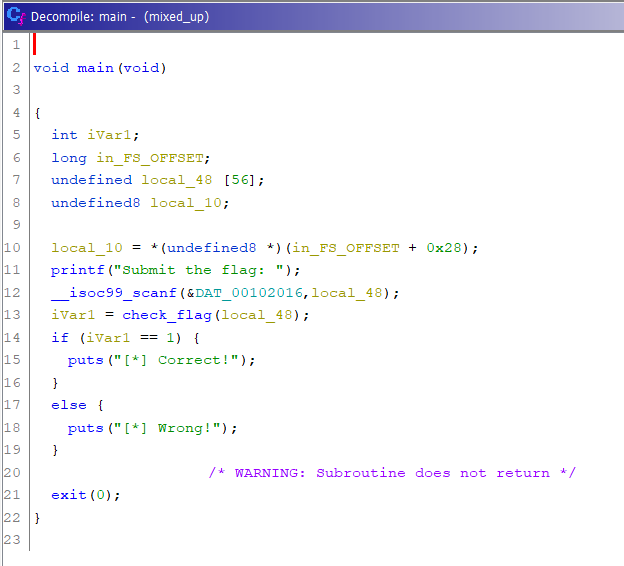
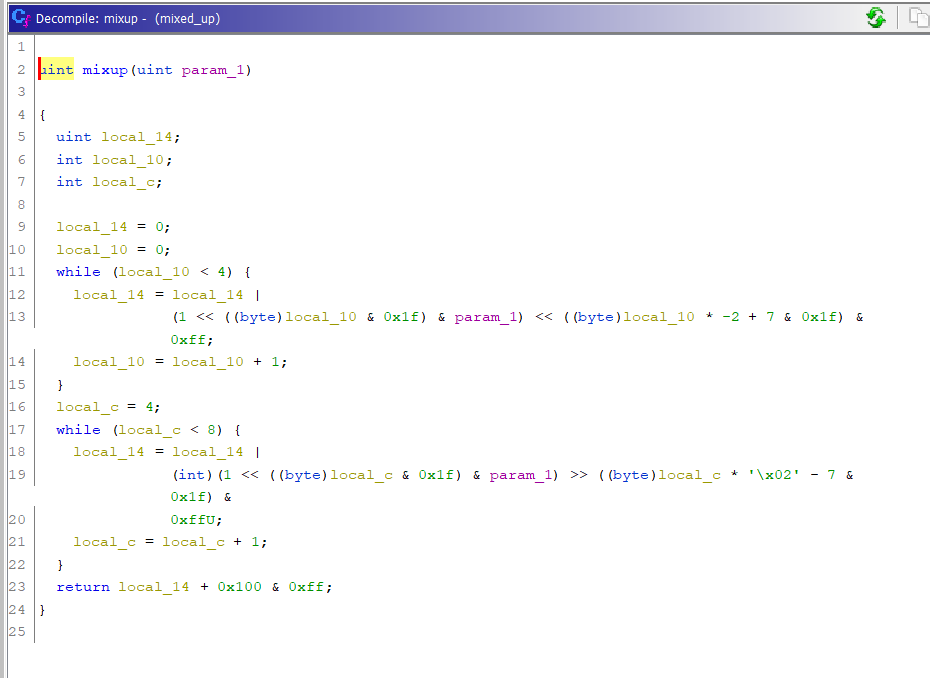
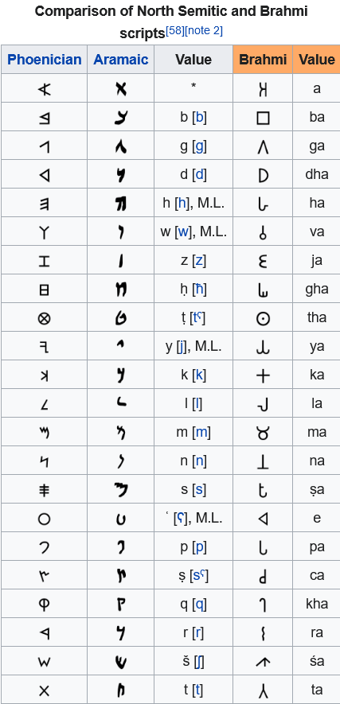

# HackRush 2021 CTF

We participated in this 3 day long capture the flag (CTF) competition hosted by [HackRush](http://3.142.26.175/) at IITGN and secured the 1st position. We had no previous experience of solving CTF challenges and had participated with the hope to know something about hacking. It is needless to say that this competition provided us the experience we needed. 

We enjoyed solving the questions, although we had to spent lots of time going through the resources and understanding the questions. But after spending time and effort, when you come across a hex byte or a string that starts as "Hack", the feeling of exhilaration is extremely rewarding.

<br>


Problem | Category | Points | Flag
--------|:----------:| :-----: |:-----:
|||<br>
[cliff](https://github.com/Harshit-Ramolia/HackRush-2021-CTF/blob/main/WriteUp.md#cliff-300-pts) | Binary Exploitation | 300 | HackRushCTF{N0w_Y0u_kn0w_ab0ut_form4t_5tr1ng5}
simple_login | Binary Exploitation | 500| -
echo_back | Binary Exploitation | 1000|-
real_hack | Binary Exploitation | 1500|-
|||<br>
[simple_check](https://github.com/Harshit-Ramolia/HackRush-2021-CTF/blob/main/WriteUp.md#simple_check-200-pts) | Reverse Engineering | 200 |HackRushCTF{x86_f1r5t_t1me?}
so_slooow | Reverse Engineering | 500 |-
[mixed_up](https://github.com/Harshit-Ramolia/HackRush-2021-CTF/blob/main/WriteUp.md#mixed_up-1000-pts) | Reverse Engineering | 1000 | HackRushCTF{Gh1dr4_1s_Tru!y_4w3s0m3}
|||<br>
[Ancient](https://github.com/Harshit-Ramolia/HackRush-2021-CTF/blob/main/WriteUp.md#ancient-50-pts) | Cryptography | 50 | HackRushCTF{asoka​}
[prime magic 1](https://github.com/Harshit-Ramolia/HackRush-2021-CTF/blob/main/WriteUp.md#prime-magic-1-100-pts) | Cryptography | 100 | HackRushCTF{RSA_1s_c00l}
[prime magic 2](https://github.com/Harshit-Ramolia/HackRush-2021-CTF/blob/main/WriteUp.md#prime-magic-2-300-pts) | Cryptography | 300 | HackRushCTF{10_1s_b3tt3r_th4n_2?}
[Double the trouble](https://github.com/Harshit-Ramolia/HackRush-2021-CTF/blob/main/WriteUp.md#double-the-trouble-800-pts) | Cryptography | 800 | HackRushCTF{7w1c3_1s_n0t_b3tt3r}


<br>
<br>


## **Binary Exploitation**

1. ### **cliff (300 pts):**
    
    **Challenge**
    
    Have you heard about garbage in, garbage out?
    Connect to the actual challenge using: 

    nc 3.142.26.175 12345

    The [C code](https://github.com/Harshit-Ramolia/HackRush-2021-CTF/blob/main/problem-files/binary-exploitation/cliff.c) and [compiled binary](https://github.com/Harshit-Ramolia/HackRush-2021-CTF/blob/main/problem-files/binary-exploitation/cliff) are given.
    
    <br>
    
    **Solution**

    After seeing the c code, we found out that, there is a `flag` variable in main function. The main function is opening a txt file and reading it and storing its value in `flag`. There is no way we could get the value of flag without the file, hence we can only get 
    the flag variable by some exploitation on the sever end.

    Since the variable `input` which has data taken from user used in `printf` as `printf(input)` instead of `printf("%s",input)`, there is a vulnerability in code which we can use.
        
        char input[512];
        fgets(input, 512, stdin);
        printf(input);

    We used format string vulnerability to obtain the hex values of the flag. As mentioned in [this article](https://ctf101.org/binary-exploitation/what-is-a-format-string-vulnerability/) `printf` can leak information from the stack if we input `%llx`. This gives the long long hex value from the stack. Using this information, we gave the input as a long string - <br>
    
    ```%llx %llx %llx %llx %llx %llx %llx %llx %llx %llx``` <br>
    
    to the given server IP and port (3.142.26.175, 12345). 

    <br>

    We then ran the above input multiple times and noticed that only some values repeated whereas other values changed on each execution. This meant that the values that were changing must be garbage values whereas the values that did not change must represent some actual information. We observed that value starting from `%10$llx` remained the same. Converting the output hex of `%10$llx` to ASCII we got “hsuRkcaH” as the ASCII value. This result motivated us and we felt that we were on the right track. We then fetched values uptill `%15$llx` after which the values again changed on different iterations. On decoding the hex values obtained from `%10$llx` to `%15$llx`, and reversing each string, we got the desired flag.

    **FLAG: &nbsp;&nbsp;&nbsp;&nbsp;&nbsp;&nbsp;HackRushCTF{N0w_Y0u_kn0w_ab0ut_form4t_5tr1ng5}**

<br>

## **Reverse Engineering**

1. ### **simple_check (200 pts)**

    **Challenge**

    Check this out, you can test if your flag is valid or not!<br>
    The [C code](https://github.com/Harshit-Ramolia/HackRush-2021-CTF/blob/main/problem-files/reverse-engineering/simple_check.c) and [compiled binary](https://github.com/Harshit-Ramolia/HackRush-2021-CTF/blob/main/problem-files/reverse-engineering/simple_check) are given.

    **Solution**

    Since we had been provided the code (c file) of this problem, solving this became very easy.

    Manually find each character by finding its ascii value and converted to its character.

        char flag[50] = "HackRushCTF{";

        for(int i = 0; i < 12; i++) {
        if(flag[i] != input[i]) {
            fail();
            }
        }

        // This part provides the intial part of the flag
    <br>
        
        if(input[12] != 120) {
            fail();
        }

        // Throgh this part we know that 13th charecter is corresponding ascii value of 120 which is "x"

        // Similary we found out all the charecters ascii and corresponding charecter


    **FLAG: &nbsp;&nbsp;&nbsp;&nbsp;&nbsp;&nbsp;HackRushCTF{x86_f1r5t_t1m3?}**

<br>

2. ### **mixed_up (1000 pts)**

    **Challenge**<br>
    What a terrible mess<br>
    Here is the [compiled binary](https://github.com/Harshit-Ramolia/HackRush-2021-CTF/blob/main/problem-files/reverse-engineering/mixed_up).

    **Solution**<br>

    We have been provided only a binary file and nothing else. Solution of simple check question had become easy because we had a code file. So, we tried to figure out some ways through which we could reverse or decompile the binary file.<br>

    First we tried to use the `strings` command to list out all the strings present in the binary file to see if the flag was stored as plaintext. This was not the case. So, we tried to analyse the binary file using tools like gdb and radare2.<br>

    Using radare2, we made some important conclusion. First off, the `main` function called a `check_flag` function. In `check_flag`, there seemed to be some sort of while loop that was run until the counter was incremented from 0 to 36. This could mean that the flag has a length of 36 which was confirmed later on. We made a few more deductions, but the assembly code was very complex to understand. After going through some online resources and [this](https://www.youtube.com/watch?v=RCgEIBfnTEI) video, we came across a wonderful tool called Ghidra.<br>

    Ghidra is an awesome tool that decompiled the binary file to a C file. Now, analysing the code was relatively easy. We found that `check_flag` was first encrypted using the `mixup` function and then it was checked against an array called `flag`. The `flag` array contained hex values. On further investigation, we found that the input was reversed and then compared with `flag`, meaning that we needed to reverse `flag` in order to obtain the correct value. Also, the input was compared only with the corresponding multiples of 4 (0, 4, 8, and so on) in the `flag` array. Thus, we had to decrypt the values present at multiples of 4 starting from index 0 and ending at index 140 ((36-1) * 4). On converting to ASCII and reversing, we captured the flag.<br>

    
    

    <br>
    And here is the code we used to crack the flag

        #include <bits/stdc++.h>
        using namespace std;
        int main()
        {
        
            int local_14, param_1=1;
            int local_10;
            int local_c;
            while (local_14 != 190)  // 190 is decimal value to corresponding character stored in FLAG array
            {
                local_14 = 0;
                local_10 = 0;
                
                while (local_10 < 4)
                {
                    local_14 = local_14 | (1 << (local_10 & 31) & param_1) << ((local_10 *( -2) + 7 & 31) & 255);
                    local_10 = local_10 + 1;
                }
                local_c = 4;
                while (local_c < 8)
                {
                    local_14 = local_14 | (int)(1 << (local_c & 31) & param_1) >> (local_c * '\x02' - 7 & 31) & 0xffU;
                    local_c = local_c + 1;
                }
                param_1++;
            }
            
            param_1--;
            cout<<local_14<<" "<<(char)param_1;
        
            return 0;
        }


    PS: The flag truly lives up to its name.

    **FLAG: &nbsp;&nbsp;&nbsp;&nbsp;&nbsp;&nbsp;HackRushCTF{Gh1dr4_1s_Tru!y_4w3s0m3}**

<br>

## **Cryptography**

1. ### **Ancient (50 pts)**

    **Challenge**<br>
    I found some wierd text, Can you find out what this means?
    <br>

    𑀩𑁆𑀭𑀸𑀳𑁆𑀫𑀻 𑀮𑀺𑀧𑀺 𑀪𑀸𑀭𑀢 𑀓𑀻 𑀧𑁆𑀭𑀸𑀘𑀻𑀦𑀢𑀫 𑀮𑀺𑀧𑀺𑀬𑁄ं 𑀫𑁂ं 𑀲𑁂 𑀏𑀓 𑀳𑁃 𑀬𑀳 𑀳𑁃 𑀆𑀧𑀓𑀸 𑀚𑀯𑀸𑀩 :
    
    HackRushCTF{𑀅𑀰𑁄𑀓​}
    
    **Solution**<br>
    After searching few letters it was easy to know that symbols belongs to brahmin script

    

    Using above table we decrypted 𑀅 and 𑀓. <br>
    Then we found [fb post](https://www.facebook.com/1094200484098434/posts/1655395287978948/),
    where it is mentioned 𑀅𑀰𑁄𑀓 = Aśōka.

    **FLAG: &nbsp;&nbsp;&nbsp;&nbsp;&nbsp;&nbsp;HackRushCTF{asoka​}**

    <br>

2. ### **prime magic 1 (100 pts)**

    **Challenge**<br>
    This should be simple.<br>
    The correct output is given at the end of the script in comments<br>
    [Here](https://github.com/Harshit-Ramolia/HackRush-2021-CTF/blob/main/problem-files/cryptography/prime_magic_1.py) is the attached python file.

    **Solution**<br>
    After reading resource about RSA from [this](https://ctf101.org/cryptography/what-is-rsa/) website, we concluded that we had to break the `big_num` into its prime factors.<br>

        big_number = 25992347861099219061069221843214518860756327486173319027118759091795941826930677

    We obtained the prime factors using [this](https://www.alpertron.com.ar/ECM.HTM) tool. 

        a = 3757160792909754673945392226295475594863
        b = 6918082374901313855125397665325977135579    

    Doing lcm of (a-1) and (b-1) using [thi site](https://goodcalculators.com/gcd-lcm-calculator/).

        c = 12996173930549609530534610921607259430372826121502753979294844150952160187100118

    Then using simple code we found out private key

        for i in range(int(10e4)):
            z = (1+i*c)//exponent
            if (1+i*c)%exponent==0:
                d=z
                print(i,z,(1+i*c)%exponent)
                break
        
        // (Private key) d = 4143141461021605992362476555001609339438476832271190913368130656664837920397375
    
    Then using this code we found out the hex of flag

        message = pow(encrypted_flag,d,big_number)
        m = hex(message)
        print(m)

        // m = 0x4861636b527573684354467b5253415f31735f6330306c7d

    Converting m to ascii we got the desire flag

    **FLAG: &nbsp;&nbsp;&nbsp;&nbsp;&nbsp;&nbsp;HackRushCTF{RSA_1s_c00l}**

    <br>

3. ### **prime magic 2 (300 pts)**

    **Challenge**<br>
    The same challenge again?<br>
    [Here](https://github.com/Harshit-Ramolia/HackRush-2021-CTF/blob/main/problem-files/cryptography/prime_magic_2.py) is the attached python file.

    **Solution**<br>
    

    **FLAG: &nbsp;&nbsp;&nbsp;&nbsp;&nbsp;&nbsp;HackRushCTF{10_1s_b3tt3r_th4n_2?}**

    <br>

4. ### **Double the trouble (800 pts)**

    **Challenge**<br>
    Wow, double the security! No one can know the flag now!<br>
    [Here](https://github.com/Harshit-Ramolia/HackRush-2021-CTF/blob/main/problem-files/cryptography/double_the_trouble.py) is the attached python file.

    **Solution**<br>
    We first proceeded by taking a for loop that was nested 6 times to find the last three bytes in both the keys.

    **FLAG: &nbsp;&nbsp;&nbsp;&nbsp;&nbsp;&nbsp;HackRushCTF{7w1c3_1s_n0t_b3tt3r}**

    <br>
